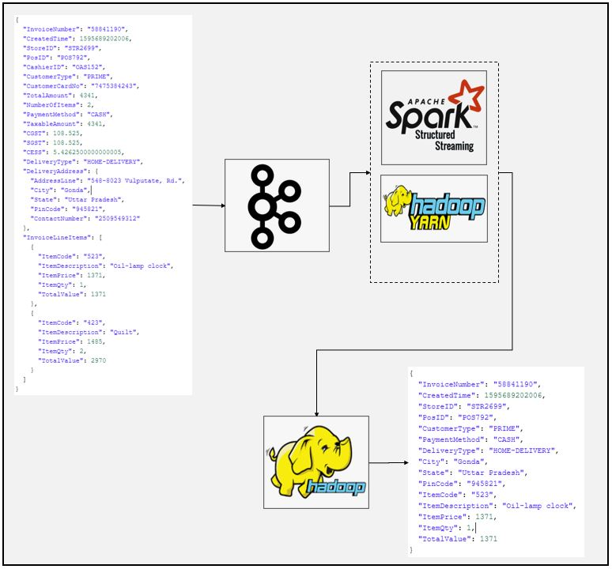

# SparkStream Kafka to Json File Sink Example
### Dataflow Pipeline


### Summary

This is kafk source and file sink example for spark streaming. In this application kafka console producer is used to stream invoice data. Spark applications read from kafka source and apply deserialization and transformation. Finally transformed data written into hdfs.

### Task List

- [x] Create kafka topics
```
/home/enes/Software/kafka_2.12-2.7.0/bin/kafka-topics.sh --create --zookeeper localhost:2181 --replication-factor 1 --partitions 1 --topic invoices
```
- [x] Create output directory on the hdfs
```
hdfs dfs -mkdir /home/enes/Applications/output2
```
- [x] Create spark session and initialize logger (You can use ".master("local[*])" instead of yarn if you are running Spark on standalone mode")
```
if __name__ == "__main__":
    spark = SparkSession \
        .builder \
        .appName("Kafka stream") \
        .config("spark.streaming.stop.stopGracefullyOnShutdown", "true") \
        .master("yarn") \
        .getOrCreate()

    logger = Log4j(spark)
```
- [x] Define schema
```
schema = StructType([
  StructField("InvoiceNumber", StringType()),
  StructField("CreatedTime", LongType()),
  StructField("StoreID", StringType()),
  StructField("PosID", StringType()),
  StructField("CashierID", StringType()),
  StructField("CustomerType", StringType()),
  StructField("CustomerCardNo", StringType()),
  StructField("TotalAmount", DoubleType()),
  StructField("NumberOfItems", IntegerType()),
  StructField("PaymentMethod", StringType()),
  StructField("CGST", DoubleType()),
  StructField("SGST", DoubleType()),
  StructField("CESS", DoubleType()),
  StructField("DeliveryType", StringType()),
  StructField("DeliveryAddress", StructType([
      StructField("AddressLine", StringType()),
      StructField("City", StringType()),
      StructField("State", StringType()),
      StructField("PinCode", StringType()),
      StructField("ContactNumber", StringType())
  ])),
  StructField("InvoiceLineItems", ArrayType(StructType([
      StructField("ItemCode", StringType()),
      StructField("ItemDescription", StringType()),
      StructField("ItemPrice", DoubleType()),
      StructField("ItemQty", IntegerType()),
      StructField("TotalValue", DoubleType())
  ]))),
])
```
- [x] Read data from kafka source
```
kafka_df = spark.readStream \
      .format("kafka") \
      .option("kafka.bootstrap.servers", "localhost:9092") \
      .option("subscribe", "invoices") \
      .option("startingOffsets", "earliest") \
      .load()

```
- [x] Apply transformations
```
value_df = kafka_df.select(from_json(col("value").cast("string"), schema).alias("value"))
  #value_df.printSchema()
  explode_df = value_df.selectExpr("value.InvoiceNumber", "value.CreatedTime", "value.StoreID",
                               "value.PosID", "value.CustomerType", "value.PaymentMethod", "value.DeliveryType",
                               "value.DeliveryAddress.City",
                               "value.DeliveryAddress.State", "value.DeliveryAddress.PinCode",
                               "explode(value.InvoiceLineItems) as LineItem")

  #explode_df.printSchema()

  flattened_df = explode_df \
  .withColumn("ItemCode", expr("LineItem.ItemCode")) \
  .withColumn("ItemDescription", expr("LineItem.ItemDescription")) \
  .withColumn("ItemPrice", expr("LineItem.ItemPrice")) \
  .withColumn("ItemQty", expr("LineItem.ItemQty")) \
  .withColumn("TotalValue", expr("LineItem.TotalValue")) \
  .drop("LineItem")
```
- [x] Write data into hdfs location
```
invoice_writer_query = flattened_df.writeStream \
    .format("json") \
    .queryName("Flattened Invoice Writer") \
    .outputMode("append") \
    .option("path", "/home/enes/Applications/output2") \
    .option("checkpointLocation", "Kafkastream/chk-point-dir") \
    .trigger(processingTime="1 minute") \
    .start()

invoice_writer_query.awaitTermination()
```

### Code Description

kafkastream.py is spark script to read data from kafka source and make desired transformations as well as writing data into hdfs location.

### Running

1. Create kafka topics

2. Run kafka-console producer
```
/home/enes/Software/kafka_2.12-2.7.0/bin/kafka-console-producer.sh --broker-list localhost:9092 --topic invoices
```
3. Enter sample data
```json
{
  "InvoiceNumber": "51402977",
  "CreatedTime": 1595688900348,
  "StoreID": "STR7188",
  "PosID": "POS956",
  "CashierID": "OAS134",
  "CustomerType": "PRIME",
  "CustomerCardNo": "4629185211",
  "TotalAmount": 11114,
  "NumberOfItems": 4,
  "PaymentMethod": "CARD",
  "TaxableAmount": 11114,
  "CGST": 277.85,
  "SGST": 277.85,
  "CESS": 13.8925,
  "DeliveryType": "TAKEAWAY",
  "InvoiceLineItems": [
    {
      "ItemCode": "458",
      "ItemDescription": "Wine glass",
      "ItemPrice": 1644,
      "ItemQty": 2,
      "TotalValue": 3288
    },
    {
      "ItemCode": "283",
      "ItemDescription": "Portable Lamps",
      "ItemPrice": 2236,
      "ItemQty": 1,
      "TotalValue": 2236
    },
    {
      "ItemCode": "498",
      "ItemDescription": "Carving knifes",
      "ItemPrice": 1424,
      "ItemQty": 2,
      "TotalValue": 2848
    },
    {
      "ItemCode": "523",
      "ItemDescription": "Oil-lamp clock",
      "ItemPrice": 1371,
      "ItemQty": 2,
      "TotalValue": 2742
    }
  ]
}
```
4. Check hdfs location for output
